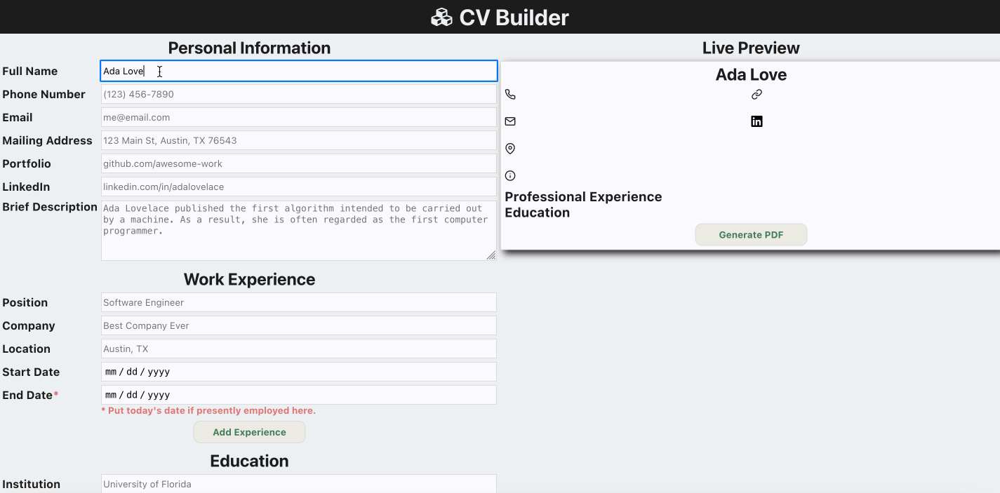

# cv builder

this is the [first react project](https://www.theodinproject.com/paths/full-stack-javascript/courses/javascript/lessons/cv-application) from the odin project's full stack javascript curriculum.

## live version

[click here](https://jernestmyers.github.io/cv-project/) for a live version!

## project objectives

1. create sections to input general information, educational experience, and professional experience.
2. create functionality to remove and/or edit inputted data.
3. create functionality to display inputted data in a stylized format.
4. leverage a package to generate a PDF of the CV.

## technologies used

 
 
 

## app features

1. users can see a live preview of the CV as they input their data.
2. users can edit and delete educational experience and professional experience.
3. both educational experience and professional experience are sorted in descending chronological order based on the end date. this functionality makes use of the [date-fns](https://date-fns.org/) library.
4. users can generate a PDF version of their CV via the [react-easy-print](https://github.com/a-x-/react-easy-print#readme) library.

## areas for improvement

1. thus far has only been formatted to display effectively on a 13" macbook air.
2. ~~the "Generate PDF" functionality has not been completed. erroneously expected to be able to use existing components to easily generate the PDF.~~
